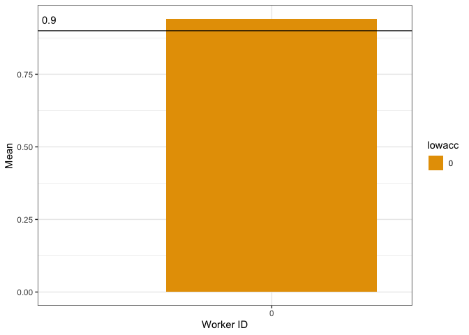

Latino English Semantic Priming
================

## Exclusions

### Native Language -

Excluding English L2

    ## # A tibble: 3 x 2
    ##   workerid first_language   
    ##      <dbl> <chr>            
    ## 1        0 SPanish, Engolish
    ## 2        0 SPanish, Engolish
    ## 3        0 zulu

### Accuracy -

Excluding participants with accuracy rates lower than 90%
<!-- -->

    ## # A tibble: 0 x 7
    ## # … with 7 variables: workerid <dbl>, Mean <dbl>, CILow <dbl>, CIHigh <dbl>,
    ## #   YMin <dbl>, YMax <dbl>, lowacc <chr>
