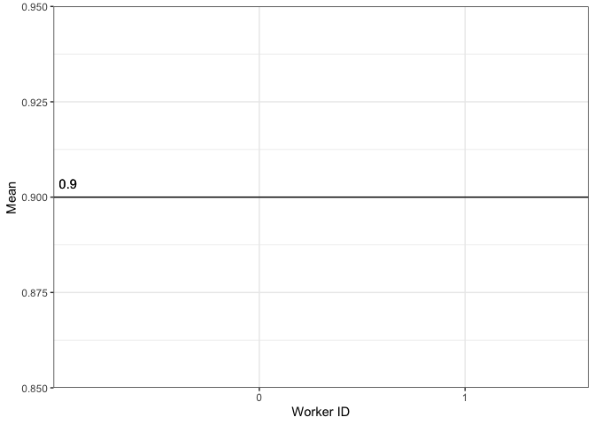
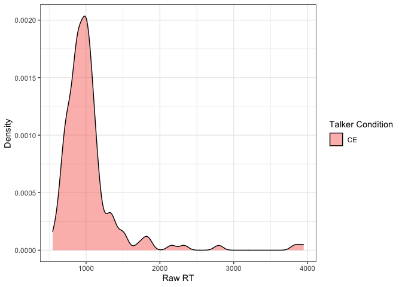
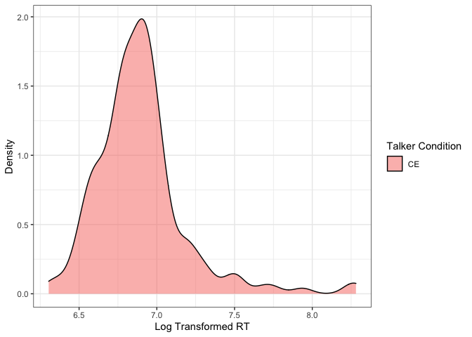
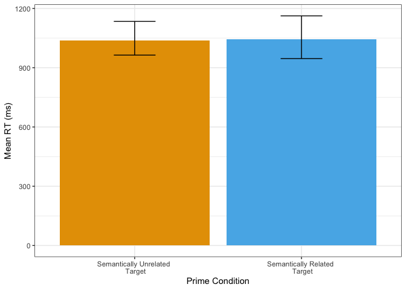
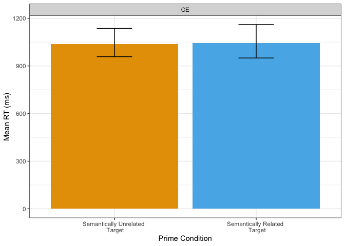

Latino English Semantic Priming
================

## Exclusions

### Native Language

Excluding English L2

    ## # A tibble: 0 x 2
    ## # … with 2 variables: workerid <dbl>, first_language <chr>

### Accuracy

Excluding participants with accuracy rates lower than 90%
<!-- -->

### Duration

Excluding participants who take more than 2.5 SDs from mean completion
time

    ## # A tibble: 0 x 9
    ## # … with 9 variables: workerid <dbl>, id <int>, Answer.time_in_minutes <dbl>,
    ## #   slow <chr>, fast <chr>, Mean <dbl>, SD <dbl>, Llimit <dbl>, Ulimit <dbl>

### Individual Responses

Excluding individual responses that are faster than 500ms or more than 3
SDs from mean RT

    ## # A tibble: 19 x 10
    ##    workerid    id Response_Time slow  fast  toofast  Mean    SD Llimit Ulimit
    ##       <dbl> <int>         <dbl> <chr> <chr> <chr>   <dbl> <dbl>  <dbl>  <dbl>
    ##  1        0    63          2835 1     0     0       1163.  479.  -273.  2598.
    ##  2        0    80           474 0     0     1       1163.  479.  -273.  2598.
    ##  3        0    86          2796 1     0     0       1163.  479.  -273.  2598.
    ##  4        0   119           192 0     0     1       1163.  479.  -273.  2598.
    ##  5        0   120          3246 1     0     0       1163.  479.  -273.  2598.
    ##  6        0   143           122 0     0     1       1163.  479.  -273.  2598.
    ##  7        0   173          3753 1     0     0       1163.  479.  -273.  2598.
    ##  8        0   232          3002 1     0     0       1163.  479.  -273.  2598.
    ##  9        0   233          2651 1     0     0       1163.  479.  -273.  2598.
    ## 10        0   252            33 0     0     1       1163.  479.  -273.  2598.
    ## 11        0   295          3549 1     0     0       1163.  479.  -273.  2598.
    ## 12        1   322          3215 1     0     0       1163.  479.  -273.  2598.
    ## 13        1   323           396 0     0     1       1163.  479.  -273.  2598.
    ## 14        1   328          3719 1     0     0       1163.  479.  -273.  2598.
    ## 15        1   329          3806 1     0     0       1163.  479.  -273.  2598.
    ## 16        1   330          3710 1     0     0       1163.  479.  -273.  2598.
    ## 17        1   331           358 0     0     1       1163.  479.  -273.  2598.
    ## 18        1   383          3948 1     0     0       1163.  479.  -273.  2598.
    ## 19        1   428          3829 1     0     0       1163.  479.  -273.  2598.

## Plots

### Raw RT Histogram

<!-- -->

### Log Transformed RT Histogram

<!-- -->

### All Conditions RT Bar Plot

<!-- -->

### Split Condition RT Bar Plot

<!-- -->
