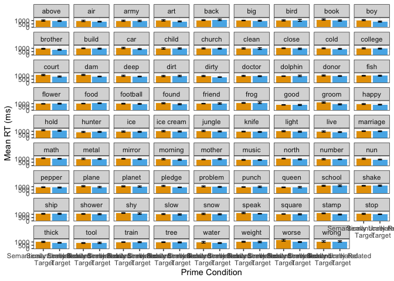
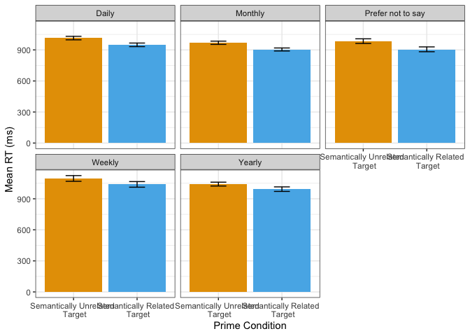
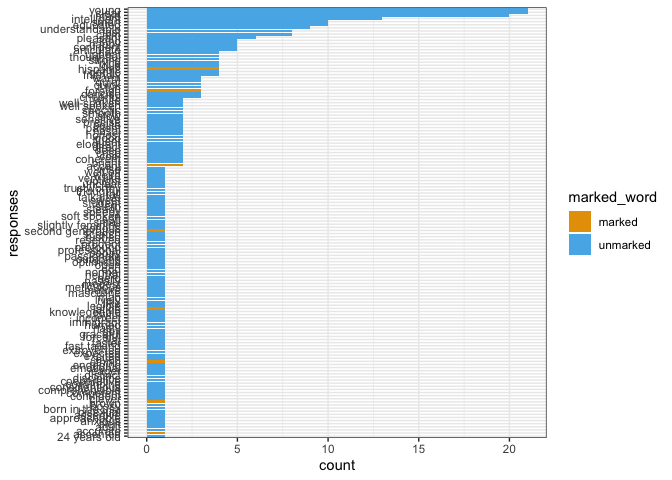

Latino English Semantic Priming
================

## Exclusions

### Native Language

Excluding English L2

    ## [1] 1

### Accuracy

Excluding participants with accuracy rates lower than 90%
<!-- -->

### Duration

Excluding participants who take more than 2.5 SDs from mean completion
time

Average Time Taken to Complete Experiment:

    ## [1] 24.24018

<!-- -->

    ## [1] 66

### Individual Responses

Excluding individual responses that are faster than 500ms or more than 3
SDs from mean RT

    ## [1] 445

Excluding Incorrect Individual Responses

    ## [1] 2318

## Plots

### Raw RT Histogram

<!-- -->

### Log Transformed RT Histogram

<!-- -->

### All Conditions RT Bar Plot

<!-- -->

### Split Condition RT Bar Plot

<!-- -->

### RTs by Trial Number

<!-- -->

### RTs for Individual Targets

<!-- -->

### RT Bar Plot by Exposure to Hispanic/Latinx Population

<!-- -->

## Additional Responses

### Analyzing Reactions to Voices

Miami Cuban American English Speaker 1
<!-- -->

Miami Cuban American English Speaker 2
<!-- -->

## Models

### Linear Mixed Model for Northeastern White American Talker Condition

### Linear Mixed Model for Miami Cuban American Talker Condition

    ## Linear mixed model fit by REML. t-tests use Satterthwaite's method [
    ## lmerModLmerTest]
    ## Formula: RT ~ centered_trial_type + (1 + centered_trial_type | workerid) +  
    ##     (1 + centered_trial_type | Target)
    ##    Data: CE_data
    ## 
    ## REML criterion at convergence: -2948.8
    ## 
    ## Scaled residuals: 
    ##     Min      1Q  Median      3Q     Max 
    ## -4.1932 -0.6068 -0.1444  0.4275  4.9296 
    ## 
    ## Random effects:
    ##  Groups   Name                Variance Std.Dev. Corr
    ##  Target   (Intercept)         0.004881 0.06986      
    ##           centered_trial_type 0.002881 0.05367  0.00
    ##  workerid (Intercept)         0.011113 0.10542      
    ##           centered_trial_type 0.001052 0.03244  0.54
    ##  Residual                     0.028903 0.17001      
    ## Number of obs: 4915, groups:  Target, 80; workerid, 64
    ## 
    ## Fixed effects:
    ##                       Estimate Std. Error         df t value Pr(>|t|)    
    ## (Intercept)           6.870894   0.015516 101.854278 442.814  < 2e-16 ***
    ## centered_trial_type  -0.069216   0.008765  80.233294  -7.897 1.27e-11 ***
    ## ---
    ## Signif. codes:  0 '***' 0.001 '**' 0.01 '*' 0.05 '.' 0.1 ' ' 1
    ## 
    ## Correlation of Fixed Effects:
    ##             (Intr)
    ## cntrd_trl_t 0.212

### Linear Mixed Model for LA Mexican American Talker Condition

### Linear Mixed Model for All Talker Conditions
