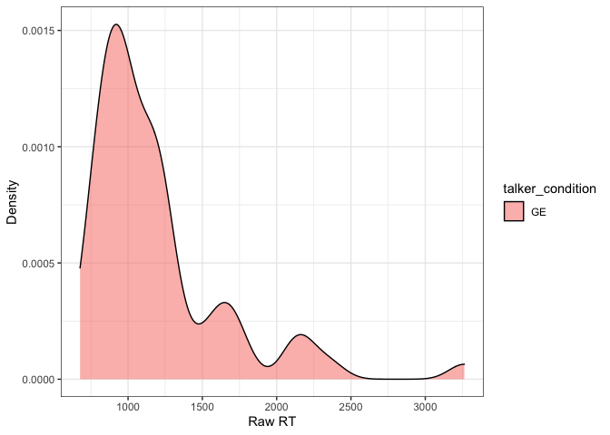
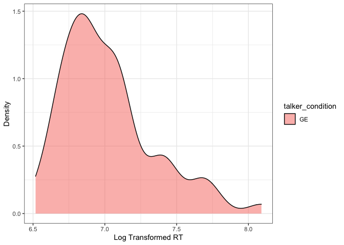
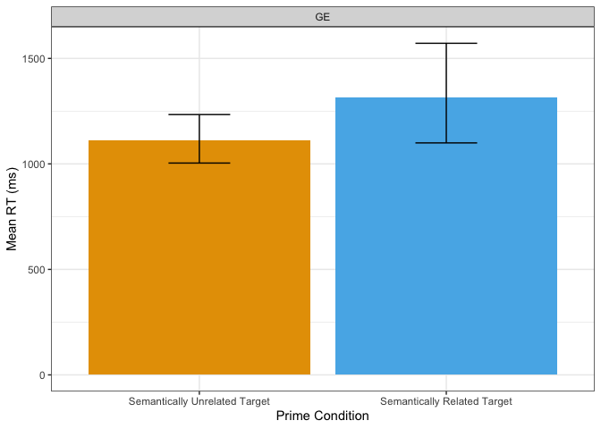

Latino English Semantic Priming
================

## Exclusions

### Native Language

Excluding English L2

    ## # A tibble: 3 x 2
    ##   workerid first_language   
    ##      <dbl> <chr>            
    ## 1        0 SPanish, Engolish
    ## 2        0 SPanish, Engolish
    ## 3        0 zulu

### Accuracy

Excluding participants with accuracy rates lower than 90%
<!-- -->

    ## # A tibble: 0 x 7
    ## # … with 7 variables: workerid <dbl>, Mean <dbl>, CILow <dbl>, CIHigh <dbl>,
    ## #   YMin <dbl>, YMax <dbl>, lowacc <chr>

### Duration

Excluding participants who take more than 2.5 SDs from mean completion
time

    ## # A tibble: 0 x 9
    ## # … with 9 variables: workerid <dbl>, id <int>, Answer.time_in_minutes <dbl>,
    ## #   slow <chr>, fast <chr>, Mean <dbl>, SD <dbl>, Llimit <dbl>, Ulimit <dbl>

### Individual Responses

Excluding individual responses that are faster than 500ms or more than 3
SDs from mean RT

    ## # A tibble: 5 x 10
    ##   workerid    id Response_Time slow  fast  toofast  Mean    SD Llimit Ulimit
    ##      <dbl> <int>         <dbl> <chr> <chr> <chr>   <dbl> <dbl>  <dbl>  <dbl>
    ## 1        0     2          3263 1     0     0       1283.  599.  -515.  3081.
    ## 2        0    11          4058 1     0     0       1283.  599.  -515.  3081.
    ## 3        0    44          4061 1     0     0       1283.  599.  -515.  3081.
    ## 4        0   148          3971 1     0     0       1283.  599.  -515.  3081.
    ## 5        0   149          3780 1     0     0       1283.  599.  -515.  3081.

## Plots

### Raw RT Histogram

<!-- -->

### Log Transformed RT Histogram

<!-- -->

### All Conditions RT Bar Plot

<!-- -->

### Split Condition RT Bar Plot

<!-- -->
